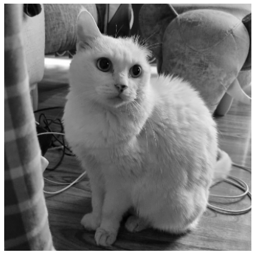
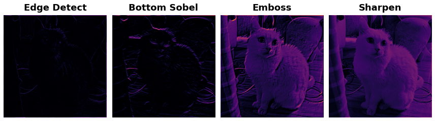
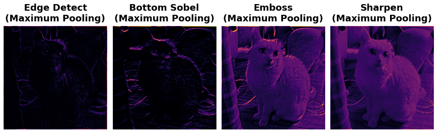
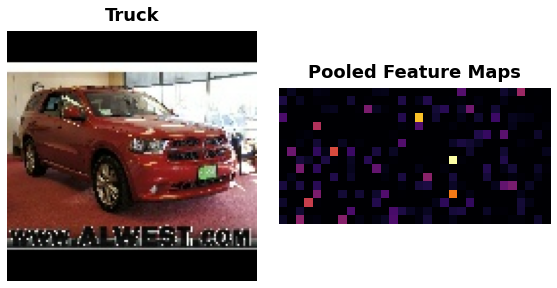

Maximum Pooling
=============

저번에 언급했듯, 이미지의 특성 추출(Feature extraction)은 아래 세 단계를 거친다.
1. 특성을 추출하기 위한 *필터* 적용 (convolution)
2. 특성을 *감지* (ReLU 이용)
3. 특성 *강화* (maximum pooling)

이번에는 필터와 ReLU함수로 뽑아낸 특성을 *Pooling*을 통해 농축시키는 과정을 적용해보자.


```python
import numpy as np
import tensorflow as tf
import matplotlib.pyplot as plt

plt.rc('figure', autolayout=True)
plt.rc('axes', labelweight='bold', labelsize='large', titleweight='bold', titlesize=18, titlepad=10 )
plt.rc('image', cmap='inferno')
```

`import` 및 `matplotlib` 기본 설정하며 시작.


```python
image_path = '../Nekko.jpg'
image = tf.io.read_file(image_path)
image = tf.io.decode_jpeg(image, channels=1)
image = tf.image.resize(image, size=[400, 400])

img = tf.squeeze(image).numpy()
plt.figure(figsize=(6,6))
plt.imshow(img, cmap='gray')
plt.axis('off')
plt.show()
```


    

    


저번과 동일하게 사진을 불러온다.

## Pooling


```python
#define kernels
names = ["Edge Detect", "Bottom Sobel", "Emboss", "Sharpen"]
kernels = [
    [[-1, -1, -1],
     [-1, 8, -1],
     [-1, -1, -1]],
    [[-1, -2, -1],
     [0, 0, 0],
     [1, 2, 1]],
    [[-2, -1, 0],
     [-1, 1, 1],
     [0, 1, 2]],
    [[0, -1, 0],
     [-1, 5, -1],
     [0, -1, 0]]
]

#transform  image and kernels into tensors
image = tf.image.convert_image_dtype(image, dtype=tf.float32)
image = tf.expand_dims(image, axis=0)

for i,k in enumerate(kernels):
    kernels[i] = tf.squeeze(tf.constant(k))

#extract and detecting features
plt.figure(figsize=(12,12))
image_filter = []
image_detect = []
for i, (name,kernel) in enumerate(zip(names, kernels)):
    kernel = tf.reshape(kernel, [*kernel.shape, 1, 1])
    kernel = tf.cast(kernel, dtype=tf.float32)
    image_filter.append(tf.nn.conv2d(
        input=image,
        filters=kernel,
        strides=1,
        padding='SAME'
    ))
    image_detect.append(tf.nn.relu(image_filter[i]))
    plt.subplot(1, 4, i+1)
    plt.imshow(tf.squeeze(image_detect[i]))
    plt.title(name)
    plt.axis('off')
plt.tight_layout()
```


    

    


- 필터의 경우 대상 픽셀과 주변부 픽셀에 일정한 값을 곱하는 연산을 하여 대상 픽셀이 그 필터에 해당하는 특성을 얼마나 갖고 있는지 수치로 나타낸다.
- 그 수치에 ReLU함수를 적용하여 특성 수치가 0보다 작은 것들은 그 특성을 가지고 있지 않다고 판단한다.
- 그 결과 위와같이 그 수치가 0인 부분이 굉장히 많이 생긴다. 의미 없는 부분이 많아진 것. 그래서 의미 있는 부분을 강조하기 위해 이번엔 필터를 적용했던것과 유사하게 Pooling을 적용한다.
- 필터는 각 픽셀마다 적용했던 것과 달리 Pooling은 해당 구역의 픽셀들을 하나로 만들어버린다. 즉 이미지가 작아진다. 
- 따라서 위치에 대한 정보는 잃어버리지만 특성에 대한 정보는 더 농축된다고 볼 수 있다.
- 이는 매우 유용한 특성이 될 수 있는데, 어떤 특성의 위치와 관계 없이 특성을 뽑아낼 수 있기 때문이다. 예를 들어 고양이가 사진의 어느 부분에 찍혔든 고양이 귀가 이 사진 내에 존재하는지 판단할 수 있는 것.


```python
image_condence = []
plt.figure(figsize=(12, 12))
for i, t in enumerate(image_detect):
    image_condence.append(tf.nn.pool(
        input = t,
        window_shape=(2,2),
        pooling_type='MAX',
        strides=(2, 2),
        padding='SAME'
    ))
    plt.subplot(1, 4, i+1)
    plt.imshow(tf.squeeze(image_condence[i]))
    plt.title('{}\n(Maximum Pooling)'.format(names[i]))
    plt.axis('off')
plt.tight_layout()
```


    

    


**Maximum pooling**을 적용한 모습이다. (2,2) 모양의 프레임을 옮겨가며 프레임 안의 픽셀들 중에서 *MAX*값으로 그 프레임의 값을 설정하는 연산을 한다. 필요 없는 픽셀을 버림으로써 조금 더 특성이 명확하게 보이는 것을확인할 수 있다.


```python
import tensorflow_hub as hub
from tensorflow.keras.preprocessing import image_dataset_from_directory
# Build model
pretrained_model = tf.keras.applications.VGG19(
    include_top = False,
    weights="imagenet",
)
model = tf.keras.Sequential([
    pretrained_model,
    tf.keras.layers.GlobalAveragePooling2D()
])

# Load dataset
ds = image_dataset_from_directory(
    '../car-or-truck/train',
    labels='inferred',
    label_mode='binary',
    image_size=[128, 128],
    interpolation='nearest',
    batch_size=1,
    shuffle=True,
)

```

    Found 5117 files belonging to 2 classes.
    

이번엔 keras에 내장된 VGG19 모델과 저번에 사용했던 데이터셋을 사용해 **Global Average Pooling**을 적용해보자. 이 모델은 4x4 크기의 feature map을 512개 내놓는다.

Global Average Pooling은 뽑아낸 feature map에 대해 픽셀 전체의 평균값을 갖는다. 즉 각 feature map을 하나의 숫자로 대체함으로써 위치 정보는 모두 버려버리고 그 특성을 갖는지만 판별하는 방식으로 볼 수 있다. 


```python
ds_iter = iter(ds)
car = next(ds_iter)

car_tf = tf.image.resize(car[0], size=[128, 128])
car_features = model(car_tf)
car_features = tf.reshape(car_features, shape=(16, 32))
label = int(tf.squeeze(car[1]).numpy())

plt.figure(figsize=(8, 4))
plt.subplot(121)
plt.imshow(tf.squeeze(car[0]))
plt.axis('off')
plt.title(["Car", "Truck"][label])
plt.subplot(122)
plt.imshow(car_features)
plt.title('Pooled Feature Maps')
plt.axis('off')
plt.show();
```


    

    


Pooling으로 512개의 feature 값을 갖게 된 모습이다.

이로써 
1. 특성을 추출하기 위한 *필터* 적용 (convolution)
2. 특성을 *감지* (ReLU 이용)
3. 특성 *강화* (maximum pooling)

라는 Feature Extracting 과정 훑어보기는 마무리!
