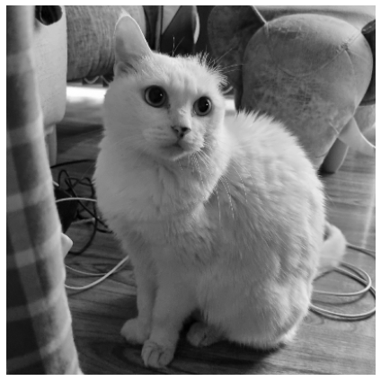

The Sliding Window
=========

Feature extraction 에서 `tf.nn.conv2d`, `tf.nn.max_pool2d` 등의 함수에서 공통된 파라미터가 있었다.

- stride=n
- padding='same'

이것들의 의미를 들여다보는 시간이다.

## Stride

Stride는 한 번에 가로세로로 얼마나 움직일 것인가를 나타낸다. Convoluional layer에서는 놓치는 정보가 없게 하기 위해 한 번에 한 픽셀씩 움직이며 모든 픽셀에 대해 필터를 적용하는 경우가 많다. 반면 pooling 단계에서는 stride를 1보다 크게 하여 좀 더 넓은 범위의 특성을 종합한다. (그래도 빠뜨리는 부분이 없도록 kernel_size 보다는 작게 설정한다.)


```python
import numpy as np
import tensorflow as tf
import matplotlib.pyplot as plt

plt.rc('figure', autolayout=True)
plt.rc('axes', labelweight='bold', labelsize='large', titleweight='bold', titlesize=18, titlepad=10 )
plt.rc('image', cmap='inferno')
```


```python
image_path = '../Nekko.jpg'
image = tf.io.read_file(image_path)
image = tf.io.decode_jpeg(image, channels=1)
image = tf.image.resize(image, size=[400, 400])

img = tf.squeeze(image).numpy()
plt.figure(figsize=(6,6))
plt.imshow(img, cmap='gray')
plt.axis('off')
plt.show()
```


    

    


이번에도 고양이 사진에 이것저것 적용해보자.


```python
image = tf.image.convert_image_dtype(image, dtype=tf.float32)
image = tf.expand_dims(image, axis=0)
image
```


    <tf.Tensor: shape=(1, 400, 400, 1), dtype=float32, numpy=
    array([[[[ 49.479126],
             [ 55.506374],
             [ 59.433125],
             ...,
             [198.      ],
             [197.2887  ],
             [198.      ]],
    
            [[ 52.463627],
             [ 54.490875],
             [ 57.400623],
             ...,
             [198.33684 ],
             [198.41548 ],
             [198.      ]],
    
            [[ 50.951874],
             [ 54.144375],
             [ 56.      ],
             ...,
             [199.7594  ],
             [199.35565 ],
             [198.5     ]],
    
            ...,
    
            [[ 52.663124],
             [ 48.566875],
             [ 42.796875],
             ...,
             [167.0376  ],
             [169.56696 ],
             [169.19238 ]],
    
            [[ 50.27106 ],
             [ 46.011177],
             [ 41.481766],
             ...,
             [163.67441 ],
             [163.7924  ],
             [169.42497 ]],
    
            [[ 49.003727],
             [ 45.25988 ],
             [ 40.566864],
             ...,
             [160.      ],
             [157.65276 ],
             [156.39407 ]]]], dtype=float32)>


```python
sobel = [tf.constant([[-1, -2, -1],
                         [0, 0, 0],
                         [1, 2, 1]
                        ]),
         tf.constant([[-1, 0, 1],
                     [-2, 0, 2],
                     [-1, 0, 1]
                    ])
]

kernel_x = tf.reshape(sobel[0], [*sobel[0].shape, 1, 1])
kernel_x = tf.cast(kernel_x, dtype=tf.float32)

kernel_y = tf.reshape(sobel[1], [*sobel[1].shape, 1, 1])
kernel_y = tf.cast(kernel_y, dtype=tf.float32)

def plot_img(stride):
    img_sobel_x = tf.nn.conv2d(
        input= image,
        filters=kernel_x,
        strides=stride,
        padding='SAME'
    )

    img_sobel_y = tf.nn.conv2d(
        input= image,
        filters=kernel_y,
        strides=stride,
        padding='SAME'
    )

    img_sobel = tf.math.sqrt(tf.math.square(img_sobel_x) + tf.math.square(img_sobel_y))


    plt.imshow(tf.squeeze(img_sobel))
    plt.axis('off')
    plt.title("{}".format(img_sobel.shape))
```

sobel filter 적용후 그리는 함수 정의.


```python
plt.figure(figsize=(12,12))
for n in range(0, 4):
    plt.subplot(1, 4, n+1)
    plot_img(n+1)
```


    

    


stride를 1,2,3,4로 설정하여 sobel filter를 적용한 모습이다. stride가 커질수록 많이 건너 뛰어 이미지 크기도 작아지고 정보를 많이 잃어버리게 된다. 지금은 3X3 필터를 적용한 모습인데, 더 큰 필터를 사용하는 경우에는 더 많은 부분이 겹치게 되어 잃어버리는 정보가 적기 때문에stride를 2~3정도로 하는 경우도 있다고 한다. 

## Padding
가장자리에 있는 픽셀들의 경우 필터의 중앙에 놓고 계산할 수 없다. 이 부분에 대한 처리를 어떻게 할지 정하는 것이 Padding 옵션이다. 

크게 두 가지 선택지가 있는데, 다음과 같다. 
- `padding='valid'` : 필터를 이미지 안에서만 돌린다. 따라서 적용 결과물은 가장자리에 대한 정보를 잃고 이미지 크기가 작아진다.
- `padding='same'`: 필터를 모든 픽셀에 대해 적용하며, 이미지를 넘어가는 부분은 0으로 간주한다. 0이라는 불순물을 섞는 것이므로 가장자리의 특성을 모두 반영하진 못하지만 이미지 크기를 유지할 수 있다.


```python
def plot_padding_img(pad, stride):
    img_sobel_x = tf.nn.conv2d(
        input= image,
        filters=kernel_x,
        strides=1,
        padding='SAME'
    )

    img_sobel_y = tf.nn.conv2d(
        input= image,
        filters=kernel_y,
        strides=1,
        padding='SAME'
    )

    img_sobel = tf.math.sqrt(tf.math.square(img_sobel_x) + tf.math.square(img_sobel_y))
    img_relu = tf.nn.relu(img_sobel)
    img_pad = tf.nn.max_pool2d(
        input=img_relu,
        ksize=4,
        strides=stride,
        padding=pad,
    )
    
    plt.imshow(tf.squeeze(img_pad))
    plt.axis('off')
    plt.title("{}\n(stride = {})\nshape = {}".format(pad, stride, tf.squeeze(img_pad).shape))
```

stride와 padding 옵션을 받아 적용하고 결과를 그리는 함수 정의


```python
plt.figure(figsize=(12,12))
for n in range(0, 2):
    plt.subplot(1, 4, 2*n+1)
    plot_padding_img('SAME', 2*n+1)
    plt.subplot(1, 4, 2*n+2)
    plot_padding_img('VALID', 2*n+1)
```


    

    


stride와 padding 종류를 바꿔서 그려본 모습. 이미지의 shape에서 SAME과 다르게 VALID는 이미지 크기가 달라짐을 알 수 있다. stride=1인 두 그림을 비교하면 좌측 하단의 가로줄이 SAME에서는 보이지만 VALID에서는 사라졌다. 약간의 정보가 손실된 것이다.
