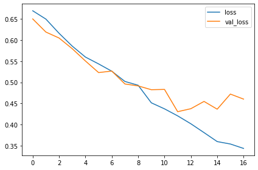
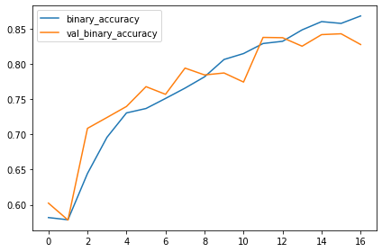
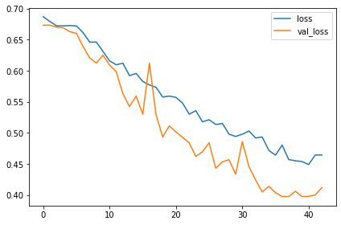
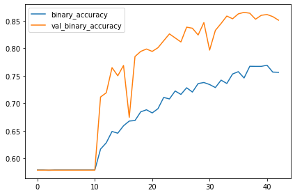
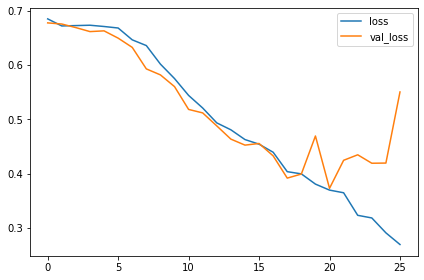
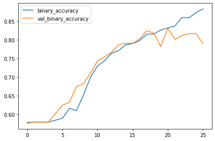
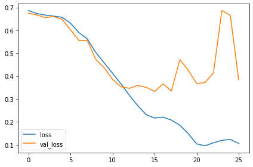
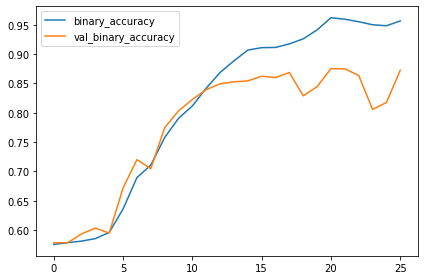
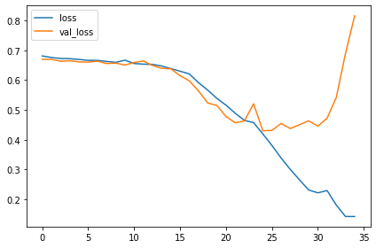
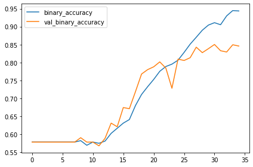

Custom Convnets
=======

앞서 알아본 feature extraction을 적용해서 resnet 같은 base model을 직접 쌓아보자. `keras`를 이용해 간단하게 할 수 있다.


```python
import tensorflow as tf
from tensorflow.keras.preprocessing import image_dataset_from_directory
import matplotlib.pyplot as plt
import numpy as np

plt.rc('figure', autolayout=True)
plt.rc('axes', labelweight='bold', labelsize='large',
       titleweight='bold', titlesize=18, titlepad=10)
plt.rc('image', cmap='plasma')

ds_train_ = image_dataset_from_directory(
    '../car-or-truck/train',
    labels='inferred',
    label_mode='binary',
    image_size=[128, 128],
    interpolation='nearest',
    batch_size=64,
    shuffle=True
)
ds_val_ = image_dataset_from_directory(
    '../car-or-truck/valid',
    labels='inferred',
    label_mode='binary',
    image_size=[128, 128],
    interpolation='nearest',
    batch_size=64,
    shuffle=False
)

def convert_to_float(image, label):
    image = tf.image.convert_image_dtype(image, dtype=tf.float32)
    return image, label

AUTOTUNE = tf.data.experimental.AUTOTUNE
ds_train = (
    ds_train_
    .map(convert_to_float)
    .cache()
    .prefetch(buffer_size=AUTOTUNE)
)
ds_val = (
    ds_val_
    .map(convert_to_float)
    .cache()
    .prefetch(buffer_size=AUTOTUNE)
)
```

    Found 5117 files belonging to 2 classes.
    Found 5051 files belonging to 2 classes.
    

이것저것 import 및 데이터셋 불러와 전처리.


```python
from tensorflow import keras
from tensorflow.keras import layers

my_conv_model = keras.Sequential([
    layers.Conv2D(filters=16, kernel_size=5, activation='relu', padding='same', input_shape=(128, 128, 3)),
    layers.MaxPool2D(),
    
    layers.Conv2D(filters=32, kernel_size=3, activation='relu', padding='same'),
    layers.MaxPool2D(),
    
    layers.Conv2D(filters=62, kernel_size=3, activation='relu', padding='same'),
    layers.MaxPool2D(),
    
    layers.Conv2D(filters=128, kernel_size=3, activation='relu', padding='same'),
    layers.MaxPool2D(),
    
    layers.Flatten(),
    layers.Dense(6, activation='relu'),
    layers.Dropout(0.3),
    layers.Dense(1, activation='sigmoid')
    
])
```

모델을 정의한다. keras로 정의하니 아주 간단하게 끝난다. 4개의 `Conv2D`, `MaxPool2D` 레이어 다음 두 개의 `Dense`층을 두었다. 01.The Convolutional Classifier에서 만들었던 모델과 유사한 모양.


```python
my_conv_model.compile(
    optimizer='adam',
    loss='binary_crossentropy',
    metrics=['binary_accuracy']
)
```


```python
early = tf.keras.callbacks.EarlyStopping(patience=5, restore_best_weights=True)

history = my_conv_model.fit(
    ds_train,
    validation_data=ds_val,
    callbacks=[early],
    epochs=50
)
```

    Epoch 1/50
    80/80 [==============================] - 7s 62ms/step - loss: 0.6696 - binary_accuracy: 0.5820 - val_loss: 0.6502 - val_binary_accuracy: 0.6025
    Epoch 2/50
    80/80 [==============================] - 3s 40ms/step - loss: 0.6498 - binary_accuracy: 0.5789 - val_loss: 0.6191 - val_binary_accuracy: 0.5785
    Epoch 3/50
    80/80 [==============================] - 3s 39ms/step - loss: 0.6161 - binary_accuracy: 0.6445 - val_loss: 0.6049 - val_binary_accuracy: 0.7086
    Epoch 4/50
    80/80 [==============================] - 3s 39ms/step - loss: 0.5857 - binary_accuracy: 0.6959 - val_loss: 0.5796 - val_binary_accuracy: 0.7240
    Epoch 5/50
    80/80 [==============================] - 3s 39ms/step - loss: 0.5598 - binary_accuracy: 0.7305 - val_loss: 0.5505 - val_binary_accuracy: 0.7397
    Epoch 6/50
    80/80 [==============================] - 3s 40ms/step - loss: 0.5436 - binary_accuracy: 0.7368 - val_loss: 0.5230 - val_binary_accuracy: 0.7678
    Epoch 7/50
    80/80 [==============================] - 3s 40ms/step - loss: 0.5262 - binary_accuracy: 0.7510 - val_loss: 0.5266 - val_binary_accuracy: 0.7569
    Epoch 8/50
    80/80 [==============================] - 3s 40ms/step - loss: 0.5019 - binary_accuracy: 0.7657 - val_loss: 0.4959 - val_binary_accuracy: 0.7941
    Epoch 9/50
    80/80 [==============================] - 3s 40ms/step - loss: 0.4929 - binary_accuracy: 0.7817 - val_loss: 0.4914 - val_binary_accuracy: 0.7844
    Epoch 10/50
    80/80 [==============================] - 3s 40ms/step - loss: 0.4513 - binary_accuracy: 0.8063 - val_loss: 0.4824 - val_binary_accuracy: 0.7872
    Epoch 11/50
    80/80 [==============================] - 3s 40ms/step - loss: 0.4370 - binary_accuracy: 0.8147 - val_loss: 0.4831 - val_binary_accuracy: 0.7743
    Epoch 12/50
    80/80 [==============================] - 3s 40ms/step - loss: 0.4203 - binary_accuracy: 0.8290 - val_loss: 0.4303 - val_binary_accuracy: 0.8377
    Epoch 13/50
    80/80 [==============================] - 3s 40ms/step - loss: 0.4016 - binary_accuracy: 0.8321 - val_loss: 0.4373 - val_binary_accuracy: 0.8373
    Epoch 14/50
    80/80 [==============================] - 3s 40ms/step - loss: 0.3806 - binary_accuracy: 0.8483 - val_loss: 0.4546 - val_binary_accuracy: 0.8252
    Epoch 15/50
    80/80 [==============================] - 3s 40ms/step - loss: 0.3594 - binary_accuracy: 0.8601 - val_loss: 0.4362 - val_binary_accuracy: 0.8416
    Epoch 16/50
    80/80 [==============================] - 3s 40ms/step - loss: 0.3536 - binary_accuracy: 0.8575 - val_loss: 0.4720 - val_binary_accuracy: 0.8428
    Epoch 17/50
    80/80 [==============================] - 3s 40ms/step - loss: 0.3431 - binary_accuracy: 0.8681 - val_loss: 0.4601 - val_binary_accuracy: 0.8276
    


```python
import pandas as pd

df_history = pd.DataFrame(history.history)
df_history.loc[:,['loss', 'val_loss']].plot()
df_history.loc[:,['binary_accuracy', 'val_binary_accuracy']].plot()
```


    <AxesSubplot:>


    

    


    

    


17 epoch의 학습 결과 약 84%의 정확도를 달성했다. 미리 학습된 resnet 모델을 이용해 학습했을 때에는 18번의 epoch 끝에 87%의 정확도를 달성했었다. resnet 모델은 학습시킨 것이 아니므로 그에 비해 이번에 학습시켜야할 parameter들이 많았던 것인데, 학습 시간에 큰 차이 없이 비슷한 정확도를 달성했다는 것이 만족스럽다.

조금 더 정확도를 끌어올려보자. train loss는 계속 줄어드는 반면 validation loss는 치솟는 부분이 보인다. 과적합이 있었던 것은 아닐까? `global average pooling` 레이어를 넣어서 모델을 단순화시켜보자.


```python
my_conv_model_gap = keras.Sequential([
    layers.Conv2D(filters=16, kernel_size=5, activation='relu', padding='same', input_shape=(128, 128, 3)),
    layers.MaxPool2D(),
    
    layers.Conv2D(filters=32, kernel_size=3, activation='relu', padding='same'),
    layers.MaxPool2D(),
    
    layers.Conv2D(filters=62, kernel_size=3, activation='relu', padding='same'),
    layers.MaxPool2D(),
    
    layers.Conv2D(filters=128, kernel_size=3, activation='relu', padding='same'),
    layers.GlobalAvgPool2D(),
    
    layers.Dense(6, activation='relu'),
    layers.Dropout(0.3),
    layers.Dense(1, activation='sigmoid')
    
])
```


```python
my_conv_model_gap.compile(
    optimizer='adam',
    loss='binary_crossentropy',
    metrics=['binary_accuracy']
)
```


```python
history_gap = my_conv_model_gap.fit(
    ds_train,
    validation_data=ds_val,
    callbacks=[early],
    epochs=50
)
```

    Epoch 1/50
    80/80 [==============================] - 4s 41ms/step - loss: 0.6867 - binary_accuracy: 0.5787 - val_loss: 0.6728 - val_binary_accuracy: 0.5785
    Epoch 2/50
    80/80 [==============================] - 3s 40ms/step - loss: 0.6789 - binary_accuracy: 0.5787 - val_loss: 0.6731 - val_binary_accuracy: 0.5785
    Epoch 3/50
    80/80 [==============================] - 3s 39ms/step - loss: 0.6720 - binary_accuracy: 0.5783 - val_loss: 0.6699 - val_binary_accuracy: 0.5785
    Epoch 4/50
    80/80 [==============================] - 3s 40ms/step - loss: 0.6719 - binary_accuracy: 0.5787 - val_loss: 0.6689 - val_binary_accuracy: 0.5785
    Epoch 5/50
    80/80 [==============================] - 3s 40ms/step - loss: 0.6724 - binary_accuracy: 0.5787 - val_loss: 0.6626 - val_binary_accuracy: 0.5785
    Epoch 6/50
    80/80 [==============================] - 3s 43ms/step - loss: 0.6719 - binary_accuracy: 0.5787 - val_loss: 0.6600 - val_binary_accuracy: 0.5785
    Epoch 7/50
    80/80 [==============================] - 3s 43ms/step - loss: 0.6612 - binary_accuracy: 0.5787 - val_loss: 0.6388 - val_binary_accuracy: 0.5785
    Epoch 8/50
    80/80 [==============================] - 3s 42ms/step - loss: 0.6458 - binary_accuracy: 0.5787 - val_loss: 0.6205 - val_binary_accuracy: 0.5785
    Epoch 9/50
    80/80 [==============================] - 3s 41ms/step - loss: 0.6460 - binary_accuracy: 0.5787 - val_loss: 0.6119 - val_binary_accuracy: 0.5785
    Epoch 10/50
    80/80 [==============================] - 3s 41ms/step - loss: 0.6309 - binary_accuracy: 0.5787 - val_loss: 0.6247 - val_binary_accuracy: 0.5785
    Epoch 11/50
    80/80 [==============================] - 3s 40ms/step - loss: 0.6156 - binary_accuracy: 0.5787 - val_loss: 0.6089 - val_binary_accuracy: 0.5785
    Epoch 12/50
    80/80 [==============================] - 3s 40ms/step - loss: 0.6094 - binary_accuracy: 0.6168 - val_loss: 0.5983 - val_binary_accuracy: 0.7115
    Epoch 13/50
    80/80 [==============================] - 3s 40ms/step - loss: 0.6119 - binary_accuracy: 0.6283 - val_loss: 0.5630 - val_binary_accuracy: 0.7193
    Epoch 14/50
    80/80 [==============================] - 3s 40ms/step - loss: 0.5918 - binary_accuracy: 0.6488 - val_loss: 0.5421 - val_binary_accuracy: 0.7650
    Epoch 15/50
    80/80 [==============================] - 3s 41ms/step - loss: 0.5955 - binary_accuracy: 0.6457 - val_loss: 0.5589 - val_binary_accuracy: 0.7501
    Epoch 16/50
    80/80 [==============================] - 3s 40ms/step - loss: 0.5825 - binary_accuracy: 0.6592 - val_loss: 0.5298 - val_binary_accuracy: 0.7690
    Epoch 17/50
    80/80 [==============================] - 3s 40ms/step - loss: 0.5768 - binary_accuracy: 0.6678 - val_loss: 0.6120 - val_binary_accuracy: 0.6745
    Epoch 18/50
    80/80 [==============================] - 3s 40ms/step - loss: 0.5732 - binary_accuracy: 0.6688 - val_loss: 0.5293 - val_binary_accuracy: 0.7852
    Epoch 19/50
    80/80 [==============================] - 3s 40ms/step - loss: 0.5574 - binary_accuracy: 0.6846 - val_loss: 0.4933 - val_binary_accuracy: 0.7945
    Epoch 20/50
    80/80 [==============================] - 3s 40ms/step - loss: 0.5590 - binary_accuracy: 0.6883 - val_loss: 0.5109 - val_binary_accuracy: 0.7989
    Epoch 21/50
    80/80 [==============================] - 3s 40ms/step - loss: 0.5570 - binary_accuracy: 0.6826 - val_loss: 0.5014 - val_binary_accuracy: 0.7945
    Epoch 22/50
    80/80 [==============================] - 3s 40ms/step - loss: 0.5477 - binary_accuracy: 0.6902 - val_loss: 0.4927 - val_binary_accuracy: 0.8012
    Epoch 23/50
    80/80 [==============================] - 3s 40ms/step - loss: 0.5299 - binary_accuracy: 0.7108 - val_loss: 0.4836 - val_binary_accuracy: 0.8139
    Epoch 24/50
    80/80 [==============================] - 3s 40ms/step - loss: 0.5355 - binary_accuracy: 0.7080 - val_loss: 0.4619 - val_binary_accuracy: 0.8264
    Epoch 25/50
    80/80 [==============================] - 3s 40ms/step - loss: 0.5175 - binary_accuracy: 0.7225 - val_loss: 0.4694 - val_binary_accuracy: 0.8190
    Epoch 26/50
    80/80 [==============================] - 3s 40ms/step - loss: 0.5209 - binary_accuracy: 0.7162 - val_loss: 0.4838 - val_binary_accuracy: 0.8117
    Epoch 27/50
    80/80 [==============================] - 3s 40ms/step - loss: 0.5133 - binary_accuracy: 0.7284 - val_loss: 0.4428 - val_binary_accuracy: 0.8386
    Epoch 28/50
    80/80 [==============================] - 3s 40ms/step - loss: 0.5150 - binary_accuracy: 0.7205 - val_loss: 0.4533 - val_binary_accuracy: 0.8367
    Epoch 29/50
    80/80 [==============================] - 3s 40ms/step - loss: 0.4977 - binary_accuracy: 0.7360 - val_loss: 0.4565 - val_binary_accuracy: 0.8244
    Epoch 30/50
    80/80 [==============================] - 3s 40ms/step - loss: 0.4940 - binary_accuracy: 0.7379 - val_loss: 0.4333 - val_binary_accuracy: 0.8470
    Epoch 31/50
    80/80 [==============================] - 3s 40ms/step - loss: 0.4976 - binary_accuracy: 0.7342 - val_loss: 0.4858 - val_binary_accuracy: 0.7969
    Epoch 32/50
    80/80 [==============================] - 3s 40ms/step - loss: 0.5029 - binary_accuracy: 0.7287 - val_loss: 0.4457 - val_binary_accuracy: 0.8327
    Epoch 33/50
    80/80 [==============================] - 3s 40ms/step - loss: 0.4916 - binary_accuracy: 0.7422 - val_loss: 0.4243 - val_binary_accuracy: 0.8454
    Epoch 34/50
    80/80 [==============================] - 3s 40ms/step - loss: 0.4931 - binary_accuracy: 0.7362 - val_loss: 0.4046 - val_binary_accuracy: 0.8588
    Epoch 35/50
    80/80 [==============================] - 3s 40ms/step - loss: 0.4716 - binary_accuracy: 0.7534 - val_loss: 0.4137 - val_binary_accuracy: 0.8539
    Epoch 36/50
    80/80 [==============================] - 3s 40ms/step - loss: 0.4639 - binary_accuracy: 0.7577 - val_loss: 0.4037 - val_binary_accuracy: 0.8628
    Epoch 37/50
    80/80 [==============================] - 3s 40ms/step - loss: 0.4802 - binary_accuracy: 0.7461 - val_loss: 0.3974 - val_binary_accuracy: 0.8656
    Epoch 38/50
    80/80 [==============================] - 3s 40ms/step - loss: 0.4569 - binary_accuracy: 0.7674 - val_loss: 0.3973 - val_binary_accuracy: 0.8640
    Epoch 39/50
    80/80 [==============================] - 3s 40ms/step - loss: 0.4549 - binary_accuracy: 0.7672 - val_loss: 0.4058 - val_binary_accuracy: 0.8531
    Epoch 40/50
    80/80 [==============================] - 3s 40ms/step - loss: 0.4537 - binary_accuracy: 0.7672 - val_loss: 0.3974 - val_binary_accuracy: 0.8602
    Epoch 41/50
    80/80 [==============================] - 3s 40ms/step - loss: 0.4487 - binary_accuracy: 0.7694 - val_loss: 0.3976 - val_binary_accuracy: 0.8616
    Epoch 42/50
    80/80 [==============================] - 3s 40ms/step - loss: 0.4643 - binary_accuracy: 0.7569 - val_loss: 0.3999 - val_binary_accuracy: 0.8578
    Epoch 43/50
    80/80 [==============================] - 3s 40ms/step - loss: 0.4641 - binary_accuracy: 0.7565 - val_loss: 0.4117 - val_binary_accuracy: 0.8513
    


```python
df_history_gap = pd.DataFrame(history_gap.history)
df_history_gap.loc[:,['loss', 'val_loss']].plot()
df_history_gap.loc[:,['binary_accuracy', 'val_binary_accuracy']].plot()
```


    <AxesSubplot:>


    

    


    

    


학습을 더 진행하여 조금더 높은 정확도를 얻었지만 (86%) validation loss와 accuracy가 튀는 현상은 더 심해졌다. 

이번엔 복잡성이 부족해져서 정확한 feature를 잡아내지 못하기 때문에 생긴 현상으로 보인다. kernel_size를 좀 건드려보고 filter가 더 많은 레이어를 하나 추가해보자.


```python
my_conv_model_mf = keras.Sequential([
    layers.Conv2D(filters=16, kernel_size=5, activation='relu', padding='same', input_shape=(128, 128, 3)),
    layers.MaxPool2D(),
    
    layers.Conv2D(filters=32, kernel_size=5, activation='relu', padding='same'),
    layers.MaxPool2D(),
    
    layers.Conv2D(filters=62, kernel_size=3, activation='relu', padding='same'),
    layers.MaxPool2D(),
    
    layers.Conv2D(filters=128, kernel_size=3, activation='relu', padding='same'),
    layers.Conv2D(filters=256, kernel_size=3, activation='relu', padding='same'),
    layers.GlobalAvgPool2D(),
    
    layers.Dense(6, activation='relu'),
    layers.Dropout(0.3),
    layers.Dense(1, activation='sigmoid')
    
])
```


```python
my_conv_model_mf.compile(
    optimizer='adam',
    loss='binary_crossentropy',
    metrics=['binary_accuracy']
)
```


```python
history_mf = my_conv_model_mf.fit(
    ds_train,
    validation_data=ds_val,
    callbacks=[early],
    epochs=50
)
```

    Epoch 1/50
    80/80 [==============================] - 6s 60ms/step - loss: 0.6851 - binary_accuracy: 0.5759 - val_loss: 0.6777 - val_binary_accuracy: 0.5785
    Epoch 2/50
    80/80 [==============================] - 4s 52ms/step - loss: 0.6721 - binary_accuracy: 0.5787 - val_loss: 0.6756 - val_binary_accuracy: 0.5785
    Epoch 3/50
    80/80 [==============================] - 4s 52ms/step - loss: 0.6728 - binary_accuracy: 0.5787 - val_loss: 0.6690 - val_binary_accuracy: 0.5785
    Epoch 4/50
    80/80 [==============================] - 4s 53ms/step - loss: 0.6734 - binary_accuracy: 0.5787 - val_loss: 0.6617 - val_binary_accuracy: 0.5785
    Epoch 5/50
    80/80 [==============================] - 4s 52ms/step - loss: 0.6711 - binary_accuracy: 0.5837 - val_loss: 0.6630 - val_binary_accuracy: 0.6013
    Epoch 6/50
    80/80 [==============================] - 4s 52ms/step - loss: 0.6683 - binary_accuracy: 0.5888 - val_loss: 0.6496 - val_binary_accuracy: 0.6236
    Epoch 7/50
    80/80 [==============================] - 4s 52ms/step - loss: 0.6465 - binary_accuracy: 0.6160 - val_loss: 0.6326 - val_binary_accuracy: 0.6324
    Epoch 8/50
    80/80 [==============================] - 4s 53ms/step - loss: 0.6359 - binary_accuracy: 0.6093 - val_loss: 0.5930 - val_binary_accuracy: 0.6739
    Epoch 9/50
    80/80 [==============================] - 4s 53ms/step - loss: 0.6018 - binary_accuracy: 0.6516 - val_loss: 0.5819 - val_binary_accuracy: 0.6826
    Epoch 10/50
    80/80 [==============================] - 4s 52ms/step - loss: 0.5752 - binary_accuracy: 0.6998 - val_loss: 0.5604 - val_binary_accuracy: 0.7104
    Epoch 11/50
    80/80 [==============================] - 4s 53ms/step - loss: 0.5441 - binary_accuracy: 0.7297 - val_loss: 0.5183 - val_binary_accuracy: 0.7436
    Epoch 12/50
    80/80 [==============================] - 4s 53ms/step - loss: 0.5209 - binary_accuracy: 0.7440 - val_loss: 0.5119 - val_binary_accuracy: 0.7543
    Epoch 13/50
    80/80 [==============================] - 4s 53ms/step - loss: 0.4935 - binary_accuracy: 0.7641 - val_loss: 0.4879 - val_binary_accuracy: 0.7664
    Epoch 14/50
    80/80 [==============================] - 4s 52ms/step - loss: 0.4808 - binary_accuracy: 0.7710 - val_loss: 0.4636 - val_binary_accuracy: 0.7874
    Epoch 15/50
    80/80 [==============================] - 4s 53ms/step - loss: 0.4628 - binary_accuracy: 0.7868 - val_loss: 0.4526 - val_binary_accuracy: 0.7907
    Epoch 16/50
    80/80 [==============================] - 4s 53ms/step - loss: 0.4543 - binary_accuracy: 0.7899 - val_loss: 0.4556 - val_binary_accuracy: 0.7905
    Epoch 17/50
    80/80 [==============================] - 4s 52ms/step - loss: 0.4394 - binary_accuracy: 0.7981 - val_loss: 0.4327 - val_binary_accuracy: 0.8028
    Epoch 18/50
    80/80 [==============================] - 4s 53ms/step - loss: 0.4037 - binary_accuracy: 0.8153 - val_loss: 0.3918 - val_binary_accuracy: 0.8250
    Epoch 19/50
    80/80 [==============================] - 4s 52ms/step - loss: 0.3996 - binary_accuracy: 0.8159 - val_loss: 0.3993 - val_binary_accuracy: 0.8181
    Epoch 20/50
    80/80 [==============================] - 4s 52ms/step - loss: 0.3807 - binary_accuracy: 0.8267 - val_loss: 0.4694 - val_binary_accuracy: 0.7824
    Epoch 21/50
    80/80 [==============================] - 4s 53ms/step - loss: 0.3697 - binary_accuracy: 0.8321 - val_loss: 0.3730 - val_binary_accuracy: 0.8315
    Epoch 22/50
    80/80 [==============================] - 4s 52ms/step - loss: 0.3648 - binary_accuracy: 0.8372 - val_loss: 0.4246 - val_binary_accuracy: 0.8014
    Epoch 23/50
    80/80 [==============================] - 4s 52ms/step - loss: 0.3232 - binary_accuracy: 0.8603 - val_loss: 0.4347 - val_binary_accuracy: 0.8115
    Epoch 24/50
    80/80 [==============================] - 4s 53ms/step - loss: 0.3184 - binary_accuracy: 0.8595 - val_loss: 0.4192 - val_binary_accuracy: 0.8169
    Epoch 25/50
    80/80 [==============================] - 4s 52ms/step - loss: 0.2910 - binary_accuracy: 0.8732 - val_loss: 0.4195 - val_binary_accuracy: 0.8171
    Epoch 26/50
    80/80 [==============================] - 4s 52ms/step - loss: 0.2694 - binary_accuracy: 0.8833 - val_loss: 0.5505 - val_binary_accuracy: 0.7897
    


```python
df_history_mf = pd.DataFrame(history_mf.history)
df_history_mf.loc[:,['loss', 'val_loss']].plot()
df_history_mf.loc[:,['binary_accuracy', 'val_binary_accuracy']].plot()
```


    <AxesSubplot:>


    

    


    

    


크게 달라지지 않았다. 정확도는 83%대로 조금 떨어졌다. 오히려 복잡성이 부족해 특성을 잘 잡아내지 못하기 때문에 생긴 현상이었던 것은 아닐까? 모델을 더 복잡하게 만들어보자.


```python
my_conv_model_mc = keras.Sequential([
    layers.Conv2D(filters=16, kernel_size=7, activation='relu', padding='same', input_shape=(128, 128, 3)),
    layers.Conv2D(filters=32, kernel_size=5, activation='relu', padding='same'),
    layers.MaxPool2D(),
    
    layers.Conv2D(filters=64, kernel_size=5, activation='relu', padding='same'),
    layers.MaxPool2D(),
    
    layers.Conv2D(filters=128, kernel_size=3, activation='relu', padding='same'),
    layers.MaxPool2D(),
    
    layers.Conv2D(filters=256, kernel_size=3, activation='relu', padding='same'),
    layers.MaxPool2D(),
    
    layers.Conv2D(filters=512, kernel_size=3, activation='relu', padding='same'),
    layers.GlobalAveragePooling2D(),
    
    layers.Dense(6, activation='relu'),
    layers.Dense(1, activation='sigmoid')
    
])
```


```python
my_conv_model_mc.compile(
    optimizer='adam',
    loss='binary_crossentropy',
    metrics=['binary_accuracy']
)
```


```python
early_2 = tf.keras.callbacks.EarlyStopping(patience=10, min_delta=0.001, restore_best_weights=True)
history_mc = my_conv_model_mc.fit(
    ds_train,
    validation_data=ds_val,
    callbacks=[early_2],
    epochs=50
)
```

    Epoch 1/50
    80/80 [==============================] - 15s 158ms/step - loss: 0.6864 - binary_accuracy: 0.5755 - val_loss: 0.6747 - val_binary_accuracy: 0.5785
    Epoch 2/50
    80/80 [==============================] - 10s 126ms/step - loss: 0.6733 - binary_accuracy: 0.5787 - val_loss: 0.6677 - val_binary_accuracy: 0.5785
    Epoch 3/50
    80/80 [==============================] - 10s 126ms/step - loss: 0.6669 - binary_accuracy: 0.5812 - val_loss: 0.6557 - val_binary_accuracy: 0.5935
    Epoch 4/50
    80/80 [==============================] - 10s 126ms/step - loss: 0.6621 - binary_accuracy: 0.5855 - val_loss: 0.6604 - val_binary_accuracy: 0.6034
    Epoch 5/50
    80/80 [==============================] - 10s 126ms/step - loss: 0.6570 - binary_accuracy: 0.5961 - val_loss: 0.6483 - val_binary_accuracy: 0.5949
    Epoch 6/50
    80/80 [==============================] - 10s 126ms/step - loss: 0.6311 - binary_accuracy: 0.6361 - val_loss: 0.6022 - val_binary_accuracy: 0.6719
    Epoch 7/50
    80/80 [==============================] - 10s 126ms/step - loss: 0.5901 - binary_accuracy: 0.6895 - val_loss: 0.5564 - val_binary_accuracy: 0.7201
    Epoch 8/50
    80/80 [==============================] - 10s 127ms/step - loss: 0.5627 - binary_accuracy: 0.7108 - val_loss: 0.5561 - val_binary_accuracy: 0.7046
    Epoch 9/50
    80/80 [==============================] - 10s 126ms/step - loss: 0.5041 - binary_accuracy: 0.7577 - val_loss: 0.4734 - val_binary_accuracy: 0.7745
    Epoch 10/50
    80/80 [==============================] - 10s 126ms/step - loss: 0.4584 - binary_accuracy: 0.7905 - val_loss: 0.4370 - val_binary_accuracy: 0.8032
    Epoch 11/50
    80/80 [==============================] - 10s 126ms/step - loss: 0.4125 - binary_accuracy: 0.8116 - val_loss: 0.3860 - val_binary_accuracy: 0.8226
    Epoch 12/50
    80/80 [==============================] - 10s 126ms/step - loss: 0.3665 - binary_accuracy: 0.8419 - val_loss: 0.3536 - val_binary_accuracy: 0.8394
    Epoch 13/50
    80/80 [==============================] - 10s 126ms/step - loss: 0.3163 - binary_accuracy: 0.8687 - val_loss: 0.3470 - val_binary_accuracy: 0.8493
    Epoch 14/50
    80/80 [==============================] - 10s 126ms/step - loss: 0.2709 - binary_accuracy: 0.8884 - val_loss: 0.3596 - val_binary_accuracy: 0.8527
    Epoch 15/50
    80/80 [==============================] - 10s 126ms/step - loss: 0.2319 - binary_accuracy: 0.9068 - val_loss: 0.3512 - val_binary_accuracy: 0.8543
    Epoch 16/50
    80/80 [==============================] - 10s 126ms/step - loss: 0.2171 - binary_accuracy: 0.9109 - val_loss: 0.3331 - val_binary_accuracy: 0.8622
    Epoch 17/50
    80/80 [==============================] - 10s 126ms/step - loss: 0.2209 - binary_accuracy: 0.9113 - val_loss: 0.3661 - val_binary_accuracy: 0.8600
    Epoch 18/50
    80/80 [==============================] - 10s 126ms/step - loss: 0.2080 - binary_accuracy: 0.9173 - val_loss: 0.3353 - val_binary_accuracy: 0.8685
    Epoch 19/50
    80/80 [==============================] - 10s 126ms/step - loss: 0.1858 - binary_accuracy: 0.9259 - val_loss: 0.4719 - val_binary_accuracy: 0.8287
    Epoch 20/50
    80/80 [==============================] - 10s 126ms/step - loss: 0.1491 - binary_accuracy: 0.9412 - val_loss: 0.4259 - val_binary_accuracy: 0.8446
    Epoch 21/50
    80/80 [==============================] - 10s 126ms/step - loss: 0.1041 - binary_accuracy: 0.9619 - val_loss: 0.3675 - val_binary_accuracy: 0.8753
    Epoch 22/50
    80/80 [==============================] - 10s 126ms/step - loss: 0.0958 - binary_accuracy: 0.9594 - val_loss: 0.3720 - val_binary_accuracy: 0.8747
    Epoch 23/50
    80/80 [==============================] - 10s 126ms/step - loss: 0.1090 - binary_accuracy: 0.9551 - val_loss: 0.4140 - val_binary_accuracy: 0.8636
    Epoch 24/50
    80/80 [==============================] - 10s 126ms/step - loss: 0.1196 - binary_accuracy: 0.9500 - val_loss: 0.6864 - val_binary_accuracy: 0.8058
    Epoch 25/50
    80/80 [==============================] - 10s 126ms/step - loss: 0.1238 - binary_accuracy: 0.9482 - val_loss: 0.6658 - val_binary_accuracy: 0.8175
    Epoch 26/50
    80/80 [==============================] - 10s 126ms/step - loss: 0.1061 - binary_accuracy: 0.9564 - val_loss: 0.3854 - val_binary_accuracy: 0.8725
    


```python
df_history_mc = pd.DataFrame(history_mc.history)
df_history_mc.loc[:,['loss', 'val_loss']].plot()
df_history_mc.loc[:,['binary_accuracy', 'val_binary_accuracy']].plot()
print(df_history_mc.val_binary_accuracy.max())
```

    0.8752722144126892
    


    

    


    

    


정확도 87%로 조금 나은 결과이지만 validation 관련 값들이 튀는 문제가 해결되어 보이진 않는다. `val_loss`와 `val_binary_accuracy`는 여전히 요동친다. 모델의 복잡성을 늘려도 특성을 잘 못잡아낸다면 학습할 데이터셋을 늘려보면 어떨까? 


```python
data_augmentation = tf.keras.Sequential([
    layers.experimental.preprocessing.RandomFlip("horizontal_and_vertical"),
    layers.experimental.preprocessing.RandomRotation(0.2)
])
```


```python
ds_train_a = (
    ds_train_
    .map(convert_to_float)
    .map(lambda x, y: (data_augmentation(x, training=True), y))
    .cache()
    .prefetch(buffer_size=AUTOTUNE)
)
```


```python
ds_train_a = ds_train_a.concatenate(ds_train)
```


```python
my_conv_model_mc_a = keras.Sequential([
    layers.Conv2D(filters=16, kernel_size=7, activation='relu', padding='same', input_shape=(128, 128, 3)),
    layers.Conv2D(filters=32, kernel_size=5, activation='relu', padding='same'),
    layers.MaxPool2D(),
    
    layers.Conv2D(filters=64, kernel_size=5, activation='relu', padding='same'),
    layers.MaxPool2D(),
    
    layers.Conv2D(filters=128, kernel_size=3, activation='relu', padding='same'),
    layers.MaxPool2D(),
    
    layers.Conv2D(filters=256, kernel_size=3, activation='relu', padding='same'),
    layers.MaxPool2D(),
    
    layers.Conv2D(filters=512, kernel_size=3, activation='relu', padding='same'),
    layers.GlobalAveragePooling2D(),
    
    layers.Dense(6, activation='relu'),
    layers.Dense(1, activation='sigmoid')
    
])
```


```python
my_conv_model_mc_a.compile(
    optimizer='adam',
    loss='binary_crossentropy',
    metrics=['binary_accuracy']
)
```


```python
history_mc_a = my_conv_model_mc_a.fit(
    ds_train_a,
    validation_data=ds_val,
    callbacks=[early_2],
    epochs=50
)
```

    Epoch 1/50
    160/160 [==============================] - 28s 166ms/step - loss: 0.6812 - binary_accuracy: 0.5787 - val_loss: 0.6696 - val_binary_accuracy: 0.5785
    Epoch 2/50
    160/160 [==============================] - 18s 111ms/step - loss: 0.6760 - binary_accuracy: 0.5787 - val_loss: 0.6698 - val_binary_accuracy: 0.5785
    Epoch 3/50
    160/160 [==============================] - 18s 111ms/step - loss: 0.6725 - binary_accuracy: 0.5787 - val_loss: 0.6632 - val_binary_accuracy: 0.5785
    Epoch 4/50
    160/160 [==============================] - 18s 111ms/step - loss: 0.6721 - binary_accuracy: 0.5787 - val_loss: 0.6650 - val_binary_accuracy: 0.5785
    Epoch 5/50
    160/160 [==============================] - 18s 111ms/step - loss: 0.6693 - binary_accuracy: 0.5787 - val_loss: 0.6611 - val_binary_accuracy: 0.5785
    Epoch 6/50
    160/160 [==============================] - 18s 111ms/step - loss: 0.6664 - binary_accuracy: 0.5787 - val_loss: 0.6604 - val_binary_accuracy: 0.5785
    Epoch 7/50
    160/160 [==============================] - 18s 111ms/step - loss: 0.6662 - binary_accuracy: 0.5787 - val_loss: 0.6637 - val_binary_accuracy: 0.5785
    Epoch 8/50
    160/160 [==============================] - 17s 108ms/step - loss: 0.6628 - binary_accuracy: 0.5787 - val_loss: 0.6558 - val_binary_accuracy: 0.5785
    Epoch 9/50
    160/160 [==============================] - 297s 2s/step - loss: 0.6596 - binary_accuracy: 0.5826 - val_loss: 0.6572 - val_binary_accuracy: 0.5908
    Epoch 10/50
    160/160 [==============================] - 18s 115ms/step - loss: 0.6671 - binary_accuracy: 0.5697 - val_loss: 0.6506 - val_binary_accuracy: 0.5785
    Epoch 11/50
    160/160 [==============================] - 18s 112ms/step - loss: 0.6557 - binary_accuracy: 0.5787 - val_loss: 0.6593 - val_binary_accuracy: 0.5785
    Epoch 12/50
    160/160 [==============================] - 18s 112ms/step - loss: 0.6536 - binary_accuracy: 0.5752 - val_loss: 0.6640 - val_binary_accuracy: 0.5682
    Epoch 13/50
    160/160 [==============================] - 18s 114ms/step - loss: 0.6529 - binary_accuracy: 0.5813 - val_loss: 0.6492 - val_binary_accuracy: 0.5890
    Epoch 14/50
    160/160 [==============================] - 18s 111ms/step - loss: 0.6473 - binary_accuracy: 0.6028 - val_loss: 0.6396 - val_binary_accuracy: 0.6314
    Epoch 15/50
    160/160 [==============================] - 18s 111ms/step - loss: 0.6387 - binary_accuracy: 0.6171 - val_loss: 0.6378 - val_binary_accuracy: 0.6213
    Epoch 16/50
    160/160 [==============================] - 18s 113ms/step - loss: 0.6300 - binary_accuracy: 0.6313 - val_loss: 0.6148 - val_binary_accuracy: 0.6747
    Epoch 17/50
    160/160 [==============================] - 18s 112ms/step - loss: 0.6209 - binary_accuracy: 0.6413 - val_loss: 0.5977 - val_binary_accuracy: 0.6716
    Epoch 18/50
    160/160 [==============================] - 18s 111ms/step - loss: 0.5915 - binary_accuracy: 0.6802 - val_loss: 0.5639 - val_binary_accuracy: 0.7189
    Epoch 19/50
    160/160 [==============================] - 18s 112ms/step - loss: 0.5666 - binary_accuracy: 0.7111 - val_loss: 0.5234 - val_binary_accuracy: 0.7680
    Epoch 20/50
    160/160 [==============================] - 18s 111ms/step - loss: 0.5388 - binary_accuracy: 0.7327 - val_loss: 0.5150 - val_binary_accuracy: 0.7802
    Epoch 21/50
    160/160 [==============================] - 18s 111ms/step - loss: 0.5157 - binary_accuracy: 0.7530 - val_loss: 0.4778 - val_binary_accuracy: 0.7882
    Epoch 22/50
    160/160 [==============================] - 18s 111ms/step - loss: 0.4888 - binary_accuracy: 0.7756 - val_loss: 0.4566 - val_binary_accuracy: 0.8018
    Epoch 23/50
    160/160 [==============================] - 18s 111ms/step - loss: 0.4649 - binary_accuracy: 0.7889 - val_loss: 0.4632 - val_binary_accuracy: 0.7846
    Epoch 24/50
    160/160 [==============================] - 18s 111ms/step - loss: 0.4572 - binary_accuracy: 0.7956 - val_loss: 0.5203 - val_binary_accuracy: 0.7284
    Epoch 25/50
    160/160 [==============================] - 18s 111ms/step - loss: 0.4195 - binary_accuracy: 0.8065 - val_loss: 0.4299 - val_binary_accuracy: 0.8095
    Epoch 26/50
    160/160 [==============================] - 18s 111ms/step - loss: 0.3804 - binary_accuracy: 0.8282 - val_loss: 0.4311 - val_binary_accuracy: 0.8058
    Epoch 27/50
    160/160 [==============================] - 18s 111ms/step - loss: 0.3383 - binary_accuracy: 0.8513 - val_loss: 0.4545 - val_binary_accuracy: 0.8135
    Epoch 28/50
    160/160 [==============================] - 18s 111ms/step - loss: 0.2999 - binary_accuracy: 0.8704 - val_loss: 0.4374 - val_binary_accuracy: 0.8428
    Epoch 29/50
    160/160 [==============================] - 18s 111ms/step - loss: 0.2650 - binary_accuracy: 0.8901 - val_loss: 0.4503 - val_binary_accuracy: 0.8276
    Epoch 30/50
    160/160 [==============================] - 18s 111ms/step - loss: 0.2311 - binary_accuracy: 0.9043 - val_loss: 0.4633 - val_binary_accuracy: 0.8386
    Epoch 31/50
    160/160 [==============================] - 18s 111ms/step - loss: 0.2216 - binary_accuracy: 0.9110 - val_loss: 0.4457 - val_binary_accuracy: 0.8503
    Epoch 32/50
    160/160 [==============================] - 18s 111ms/step - loss: 0.2293 - binary_accuracy: 0.9053 - val_loss: 0.4723 - val_binary_accuracy: 0.8329
    Epoch 33/50
    160/160 [==============================] - 18s 111ms/step - loss: 0.1804 - binary_accuracy: 0.9299 - val_loss: 0.5418 - val_binary_accuracy: 0.8293
    Epoch 34/50
    160/160 [==============================] - 18s 111ms/step - loss: 0.1422 - binary_accuracy: 0.9447 - val_loss: 0.6892 - val_binary_accuracy: 0.8495
    Epoch 35/50
    160/160 [==============================] - 18s 111ms/step - loss: 0.1420 - binary_accuracy: 0.9436 - val_loss: 0.8163 - val_binary_accuracy: 0.8460
    


```python
df_history_mc_a = pd.DataFrame(history_mc_a.history)
df_history_mc_a.loc[:,['loss', 'val_loss']].plot()
df_history_mc_a.loc[:,['binary_accuracy', 'val_binary_accuracy']].plot()
print(df_history_mc_a.val_binary_accuracy.max())
```

    0.850326657295227
    


    

    


    

    


그다지 도움이 되진 않았다. 오히려 마지막 부분에서 과적합이 발생했다. 최종적으로 달성한 정확도 역시 85%정도이다. 데이터셋을 늘려서 해결할 수 있는 문제가 아닌 것으로 보인다. 유용한 feature를 뽑아내기 위해서는 layer의 개수와 구조 변경이 필요하다고 생각된다. 이 챕터는 이정도로 마무리하고 넘어가자.
