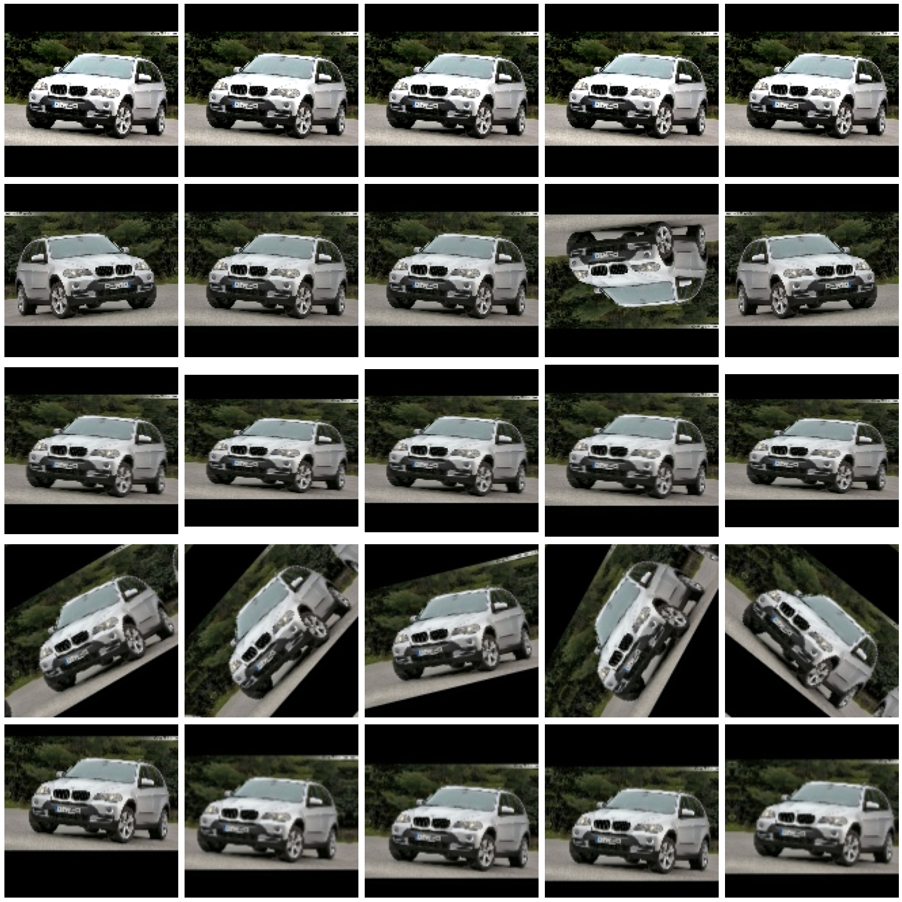
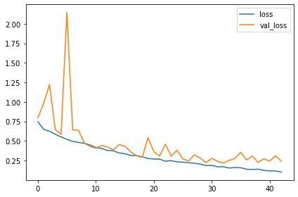
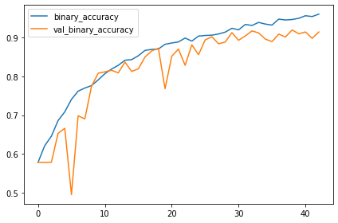

Data Augmentation
=========

`05.Custom Convnets` 에서 마지막에 잠깐 다뤘던 `Data Augmentation`을 살펴보자. 

모델의 성능에 직결되는 요소 중 하나는 당연하게도 학습에 사용되는 데이터의 질과 양이다. 그 중 양을 늘리기 위한 간단한 방법 중 하나가 Data Augmentation이다. 기존에 갖고 있는 데이터를 뒤집거나 살짝 기울이거나, 색, 대비를 조절하여 새로운 데이터를 추가하는 것이다. 

이 때, 데이터의 성질을 고려하여 변형의 정도를 정해야 한다. 예를 들어 손글씨 분류를 위한 학습데이터에 뒤집거나 기울이는 변형을 적용한다면 6과 9는 구별하기 어려워지는 사태가 발생할 것이다.


```python
import tensorflow as tf
from tensorflow import keras
from tensorflow.keras import layers
from tensorflow.keras.layers.experimental import preprocessing
from tensorflow.keras.preprocessing import image_dataset_from_directory

import matplotlib.pyplot as plt

import numpy as np

plt.rc('figure', autolayout=True)
plt.rc('axes', labelweight='bold', labelsize='large', titleweight='bold', titlesize=18, titlepad=10)
plt.rc('image', cmap='cividis')

ds_train_ = image_dataset_from_directory(
    '../car-or-truck/train',
    labels='inferred',
    label_mode='binary',
    image_size=[128, 128],
    interpolation='nearest',
    batch_size=64,
    shuffle=True
)

ds_val_ = image_dataset_from_directory(
    '../car-or-truck/valid',
    labels='inferred',
    label_mode='binary',
    image_size=[128, 128],
    interpolation='nearest',
    batch_size=64,
    shuffle=False
)

def convert_to_float(image, label):
    image = tf.image.convert_image_dtype(image, dtype=tf.float32)
    return image, label

AUTOTUNE = tf.data.experimental.AUTOTUNE

ds_train = (
    ds_train_
    .map(convert_to_float)
    .cache()
    .prefetch(buffer_size=AUTOTUNE)
)

ds_val = (
    ds_val_
    .map(convert_to_float)
    .cache()
    .prefetch(buffer_size=AUTOTUNE)
)
```

    Found 5117 files belonging to 2 classes.
    Found 5051 files belonging to 2 classes.
    

이것저것 `import` 및 데이터셋을 불러온다.


```python
ex = next(iter(ds_train.unbatch().map(lambda x, y: x).batch(1)))

augment = [
    keras.Sequential([
        preprocessing.RandomContrast(factor=0.5)
    ]),
    keras.Sequential([
        preprocessing.RandomFlip(mode='horizontal_and_vertical')
    ]),
    keras.Sequential([
        preprocessing.RandomWidth(factor=0.15)
    ]),
    keras.Sequential([
        preprocessing.RandomRotation(factor=0.2)
    ]),
    keras.Sequential([
        preprocessing.RandomTranslation(height_factor=0.1, width_factor=0.1)
    ])
]

plt.figure(figsize=(20,20))
for i in range(5):
    for j in range(5):
        image = augment[i](ex, training=True)
        plt.subplot(5, 5, i*5 + j + 1)
        plt.imshow(tf.squeeze(image))
        plt.axis('off')
plt.show()
```

    Clipping input data to the valid range for imshow with RGB data ([0..1] for floats or [0..255] for integers).
    Clipping input data to the valid range for imshow with RGB data ([0..1] for floats or [0..255] for integers).
    Clipping input data to the valid range for imshow with RGB data ([0..1] for floats or [0..255] for integers).
    Clipping input data to the valid range for imshow with RGB data ([0..1] for floats or [0..255] for integers).
    Clipping input data to the valid range for imshow with RGB data ([0..1] for floats or [0..255] for integers).
    


    

    


`RandomContrast`,`RandomFlip`,`RandomWidth`,`RandomRotation`,`RandomTranslation`의 효과는 위와 같다.

차, 트럭 데이터에 대해서는 RandomContrast, RandomFlip, RandomRotation, RandomTranslation이 모두 효과 있을 것 같다. 저번에는 데이터셋에 먼저 처리를 한 후 그 데이터를 학습시켰는데, 데이터 처리 과정을 모델에 포함하면 각 배치마다 새로 처리된 데이터로 학습될 것이므로 더 많은 데이터로 학습시키는 효과가 있을 것이다. 

또한 저번 학습 과정에서 loss = 0.6808 근처에서 학습이 전혀 진행이 되지 않았던 경우가 있었는데, initialization시의 값이나 learning rate로 인해 local optimum에 빠져서 그랬던 것이 아닐까 싶다. 이런 문제를 완화할 수 있도록 Batch noermalization도 적용시켜보자.


```python
my_conv_model = keras.Sequential([
    
    layers.InputLayer(input_shape=[128, 128, 3]),
    
    preprocessing.RandomContrast(factor=0.2),
    preprocessing.RandomFlip(mode='horizontal'),
    preprocessing.RandomRotation(factor=0.1),
    preprocessing.RandomTranslation(height_factor=0.1, width_factor=0.1),

    layers.BatchNormalization(),
    layers.Conv2D(filters=16, kernel_size=7, activation='relu', padding='same', input_shape=(128, 128, 3)),
    layers.Conv2D(filters=32, kernel_size=5, activation='relu', padding='same'),
    layers.MaxPool2D(),
    
    layers.BatchNormalization(),
    layers.Conv2D(filters=64, kernel_size=5, activation='relu', padding='same'),
    layers.MaxPool2D(),
    
    layers.BatchNormalization(),
    layers.Conv2D(filters=128, kernel_size=3, activation='relu', padding='same'),
    layers.MaxPool2D(),
    
    layers.BatchNormalization(),
    layers.Conv2D(filters=256, kernel_size=3, activation='relu', padding='same'),
    layers.MaxPool2D(),
    
    layers.BatchNormalization(),
    layers.Conv2D(filters=512, kernel_size=3, activation='relu', padding='same'),
    layers.GlobalAveragePooling2D(),
    
    layers.BatchNormalization(),
    layers.Dense(6, activation='relu'),
    layers.Dense(1, activation='sigmoid')
    
])
```


```python
my_conv_model.compile(
    optimizer='adam',
    loss='binary_crossentropy',
    metrics=['binary_accuracy']
)
```


```python
early = keras.callbacks.EarlyStopping(patience=10, min_delta=0.001, restore_best_weights=True)

history = my_conv_model.fit(
    ds_train,
    validation_data=ds_val,
    callbacks=[early],
    epochs=50
)
```

    Epoch 1/50
    80/80 [==============================] - 24s 225ms/step - loss: 0.7466 - binary_accuracy: 0.5785 - val_loss: 0.7966 - val_binary_accuracy: 0.5787
    Epoch 2/50
    80/80 [==============================] - 13s 168ms/step - loss: 0.6475 - binary_accuracy: 0.6213 - val_loss: 0.9833 - val_binary_accuracy: 0.5785
    Epoch 3/50
    80/80 [==============================] - 12s 149ms/step - loss: 0.6253 - binary_accuracy: 0.6459 - val_loss: 1.2239 - val_binary_accuracy: 0.5789
    Epoch 4/50
    80/80 [==============================] - 12s 149ms/step - loss: 0.5857 - binary_accuracy: 0.6861 - val_loss: 0.6448 - val_binary_accuracy: 0.6533
    Epoch 5/50
    80/80 [==============================] - 12s 150ms/step - loss: 0.5520 - binary_accuracy: 0.7084 - val_loss: 0.5832 - val_binary_accuracy: 0.6662
    Epoch 6/50
    80/80 [==============================] - 12s 149ms/step - loss: 0.5209 - binary_accuracy: 0.7407 - val_loss: 2.1452 - val_binary_accuracy: 0.4953
    Epoch 7/50
    80/80 [==============================] - 12s 149ms/step - loss: 0.4941 - binary_accuracy: 0.7618 - val_loss: 0.6430 - val_binary_accuracy: 0.6983
    Epoch 8/50
    80/80 [==============================] - 12s 149ms/step - loss: 0.4820 - binary_accuracy: 0.7698 - val_loss: 0.6382 - val_binary_accuracy: 0.6904
    Epoch 9/50
    80/80 [==============================] - 12s 149ms/step - loss: 0.4691 - binary_accuracy: 0.7760 - val_loss: 0.4761 - val_binary_accuracy: 0.7743
    Epoch 10/50
    80/80 [==============================] - 12s 149ms/step - loss: 0.4477 - binary_accuracy: 0.7907 - val_loss: 0.4276 - val_binary_accuracy: 0.8080
    Epoch 11/50
    80/80 [==============================] - 12s 150ms/step - loss: 0.4158 - binary_accuracy: 0.8067 - val_loss: 0.4099 - val_binary_accuracy: 0.8115
    Epoch 12/50
    80/80 [==============================] - 12s 149ms/step - loss: 0.4041 - binary_accuracy: 0.8186 - val_loss: 0.4397 - val_binary_accuracy: 0.8155
    Epoch 13/50
    80/80 [==============================] - 12s 149ms/step - loss: 0.3782 - binary_accuracy: 0.8282 - val_loss: 0.4236 - val_binary_accuracy: 0.8089
    Epoch 14/50
    80/80 [==============================] - 12s 150ms/step - loss: 0.3738 - binary_accuracy: 0.8413 - val_loss: 0.3847 - val_binary_accuracy: 0.8365
    Epoch 15/50
    80/80 [==============================] - 12s 149ms/step - loss: 0.3468 - binary_accuracy: 0.8429 - val_loss: 0.4532 - val_binary_accuracy: 0.8125
    Epoch 16/50
    80/80 [==============================] - 12s 150ms/step - loss: 0.3362 - binary_accuracy: 0.8528 - val_loss: 0.4325 - val_binary_accuracy: 0.8190
    Epoch 17/50
    80/80 [==============================] - 12s 150ms/step - loss: 0.3153 - binary_accuracy: 0.8665 - val_loss: 0.3617 - val_binary_accuracy: 0.8495
    Epoch 18/50
    80/80 [==============================] - 12s 150ms/step - loss: 0.3118 - binary_accuracy: 0.8693 - val_loss: 0.3106 - val_binary_accuracy: 0.8654
    Epoch 19/50
    80/80 [==============================] - 12s 150ms/step - loss: 0.2973 - binary_accuracy: 0.8702 - val_loss: 0.2911 - val_binary_accuracy: 0.8721
    Epoch 20/50
    80/80 [==============================] - 12s 150ms/step - loss: 0.2752 - binary_accuracy: 0.8824 - val_loss: 0.5412 - val_binary_accuracy: 0.7680
    Epoch 21/50
    80/80 [==============================] - 12s 150ms/step - loss: 0.2695 - binary_accuracy: 0.8857 - val_loss: 0.3632 - val_binary_accuracy: 0.8515
    Epoch 22/50
    80/80 [==============================] - 12s 150ms/step - loss: 0.2671 - binary_accuracy: 0.8884 - val_loss: 0.3070 - val_binary_accuracy: 0.8701
    Epoch 23/50
    80/80 [==============================] - 12s 149ms/step - loss: 0.2406 - binary_accuracy: 0.8984 - val_loss: 0.4564 - val_binary_accuracy: 0.8282
    Epoch 24/50
    80/80 [==============================] - 12s 149ms/step - loss: 0.2471 - binary_accuracy: 0.8906 - val_loss: 0.3058 - val_binary_accuracy: 0.8810
    Epoch 25/50
    80/80 [==============================] - 12s 149ms/step - loss: 0.2327 - binary_accuracy: 0.9035 - val_loss: 0.3811 - val_binary_accuracy: 0.8555
    Epoch 26/50
    80/80 [==============================] - 12s 151ms/step - loss: 0.2278 - binary_accuracy: 0.9050 - val_loss: 0.2705 - val_binary_accuracy: 0.8937
    Epoch 27/50
    80/80 [==============================] - 12s 155ms/step - loss: 0.2203 - binary_accuracy: 0.9058 - val_loss: 0.2429 - val_binary_accuracy: 0.9018
    Epoch 28/50
    80/80 [==============================] - 17s 217ms/step - loss: 0.2150 - binary_accuracy: 0.9089 - val_loss: 0.3220 - val_binary_accuracy: 0.8836
    Epoch 29/50
    80/80 [==============================] - 14s 180ms/step - loss: 0.2035 - binary_accuracy: 0.9136 - val_loss: 0.2815 - val_binary_accuracy: 0.8881
    Epoch 30/50
    80/80 [==============================] - 14s 178ms/step - loss: 0.1856 - binary_accuracy: 0.9236 - val_loss: 0.2224 - val_binary_accuracy: 0.9123
    Epoch 31/50
    80/80 [==============================] - 14s 177ms/step - loss: 0.1863 - binary_accuracy: 0.9195 - val_loss: 0.2775 - val_binary_accuracy: 0.8927
    Epoch 32/50
    80/80 [==============================] - 14s 177ms/step - loss: 0.1691 - binary_accuracy: 0.9334 - val_loss: 0.2386 - val_binary_accuracy: 0.9038
    Epoch 33/50
    80/80 [==============================] - 14s 177ms/step - loss: 0.1699 - binary_accuracy: 0.9308 - val_loss: 0.2160 - val_binary_accuracy: 0.9168
    Epoch 34/50
    80/80 [==============================] - 14s 177ms/step - loss: 0.1535 - binary_accuracy: 0.9386 - val_loss: 0.2517 - val_binary_accuracy: 0.9115
    Epoch 35/50
    80/80 [==============================] - 14s 177ms/step - loss: 0.1597 - binary_accuracy: 0.9343 - val_loss: 0.2754 - val_binary_accuracy: 0.8957
    Epoch 36/50
    80/80 [==============================] - 14s 177ms/step - loss: 0.1564 - binary_accuracy: 0.9318 - val_loss: 0.3550 - val_binary_accuracy: 0.8891
    Epoch 37/50
    80/80 [==============================] - 14s 177ms/step - loss: 0.1381 - binary_accuracy: 0.9470 - val_loss: 0.2566 - val_binary_accuracy: 0.9085
    Epoch 38/50
    80/80 [==============================] - 14s 177ms/step - loss: 0.1353 - binary_accuracy: 0.9449 - val_loss: 0.3063 - val_binary_accuracy: 0.9010
    Epoch 39/50
    80/80 [==============================] - 14s 177ms/step - loss: 0.1390 - binary_accuracy: 0.9461 - val_loss: 0.2241 - val_binary_accuracy: 0.9192
    Epoch 40/50
    80/80 [==============================] - 14s 177ms/step - loss: 0.1224 - binary_accuracy: 0.9492 - val_loss: 0.2730 - val_binary_accuracy: 0.9093
    Epoch 41/50
    80/80 [==============================] - 14s 177ms/step - loss: 0.1170 - binary_accuracy: 0.9558 - val_loss: 0.2423 - val_binary_accuracy: 0.9141
    Epoch 42/50
    80/80 [==============================] - 14s 177ms/step - loss: 0.1154 - binary_accuracy: 0.9537 - val_loss: 0.3105 - val_binary_accuracy: 0.8976
    Epoch 43/50
    80/80 [==============================] - 14s 177ms/step - loss: 0.1024 - binary_accuracy: 0.9599 - val_loss: 0.2416 - val_binary_accuracy: 0.9141
    


```python
import pandas as pd
history_df = pd.DataFrame(history.history)
history_df.loc[:, ['loss', 'val_loss']].plot()
history_df.loc[:, ['binary_accuracy', 'val_binary_accuracy']].plot()
print("Highest validation accuracy: {}".format(history_df.val_binary_accuracy.max()))
```

    Highest validation accuracy: 0.9192239046096802
    


    

    


    

    


학습 과정에서 학습이 멈추는 문제도 없었고, 정확도는 91.9%를 달성하며 만족스러운 결과를 얻었다. 다양한 데이터셋 및 batch normalization의 효과를 체감할 수 있는 결과이다. 
