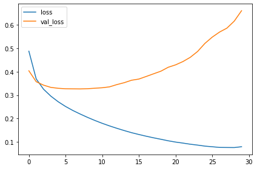
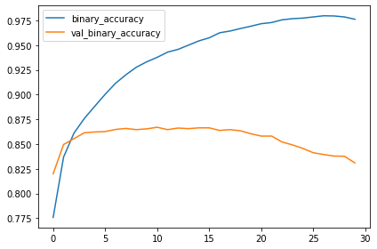
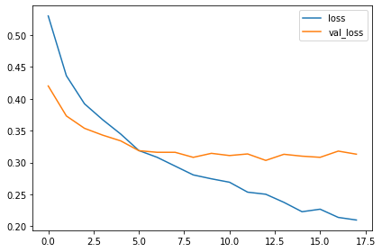
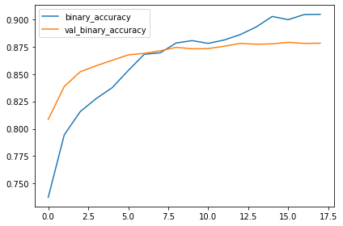

Convolutional neural networks (CNN)
=====================


>  resnetV1 모델을 베이스로 이미지 분류기를 학습시켜보자!


```python
import os, warnings
import matplotlib.pyplot as plt
import numpy as np
import tensorflow as tf
from tensorflow.keras.preprocessing import image_dataset_from_directory
import tensorflow_hub as hub
```

이것저것 import


```python
plt.rc('figure', autolayout=True)
plt.rc('axes', labelweight='bold', labelsize='large', titleweight='bold', titlesize=18, titlepad=10)
plt.rc('image', cmap='inferno')
```

matplotlib 기본 설정


```python
train_dataset = image_dataset_from_directory(
    './car-or-truck/train',
    labels='inferred',
    label_mode='binary',
    image_size=[128, 128],
    interpolation='nearest',
    batch_size=64,
    shuffle=True
)
valid_dataset = image_dataset_from_directory(
    './car-or-truck/valid',
    labels='inferred',
    label_mode='binary',
    image_size=[128, 128],
    interpolation='nearest',
    batch_size=64,
    shuffle=False
)
```

    Found 5117 files belonging to 2 classes.
    Found 5051 files belonging to 2 classes.
    

keras의 image_dataset_from_directory로 데이터를 불러온다

* labels : 'inferred', None, list/tuple
* label_mode : 분류 방식
* image_size : 이미지 크기
* interpolation : 빈칸 채우기
* batch_size : 배치 크기
* shuffle : 순서 무작위로


```python
def convert_to_float(image, label):
    image = tf.image.convert_image_dtype(image, dtype=tf.float32)
    return image, label

AUTOTUNE = tf.data.experimental.AUTOTUNE

train_dataset = (
    train_dataset
    .map(convert_to_float)
    .cache()
    .prefetch(buffer_size=AUTOTUNE)
)

valid_dataset = (
    valid_dataset
    .map(convert_to_float)
    .cache()
    .prefetch(buffer_size=AUTOTUNE)
)
```

tf.data.Dataset 객체의 map, cache, prefetch 메소드로 학습에 맞게 preprocessing


```python
base_model = hub.KerasLayer("https://tfhub.dev/google/imagenet/resnet_v1_152/feature_vector/5", 
                            trainable=False)
```

tensorflow_hub에서 resnet_v1_152 모델을 불러온다. 

미리 학습된 모델을 가져오므로 이 부분은 학습시키지 않는다.


```python
from tensorflow import keras
from tensorflow.keras import layers

model = keras.Sequential([
    base_model,
    layers.Dense(6, activation='relu'),
    layers.Dense(1, activation='sigmoid')
])
```

모델 구성. resnet_v1 모델에 아주 간단한 Dense layer 두 개를 쌓았다.


```python
model.compile(
    optimizer='adam',
    loss='binary_crossentropy',
    metrics=['binary_accuracy']
)
```

모델 컴파일. ADAM optimizer를 사용하고 이진 분류에 맞는 loss function과 metrics 설정


```python
history = model.fit(
    train_dataset,
    validation_data=valid_dataset,
    epochs=30
)
```

    Epoch 1/30
    80/80 [==============================] - 44s 386ms/step - loss: 0.4879 - binary_accuracy: 0.7758 - val_loss: 0.4040 - val_binary_accuracy: 0.8200
    Epoch 2/30
    80/80 [==============================] - 27s 337ms/step - loss: 0.3693 - binary_accuracy: 0.8368 - val_loss: 0.3572 - val_binary_accuracy: 0.8495
    Epoch 3/30
    80/80 [==============================] - 27s 340ms/step - loss: 0.3251 - binary_accuracy: 0.8611 - val_loss: 0.3426 - val_binary_accuracy: 0.8555
    Epoch 4/30
    80/80 [==============================] - 27s 338ms/step - loss: 0.2954 - binary_accuracy: 0.8759 - val_loss: 0.3329 - val_binary_accuracy: 0.8614
    Epoch 5/30
    80/80 [==============================] - 27s 339ms/step - loss: 0.2714 - binary_accuracy: 0.8882 - val_loss: 0.3290 - val_binary_accuracy: 0.8622
    Epoch 6/30
    80/80 [==============================] - 27s 340ms/step - loss: 0.2513 - binary_accuracy: 0.9003 - val_loss: 0.3271 - val_binary_accuracy: 0.8626
    Epoch 7/30
    80/80 [==============================] - 28s 351ms/step - loss: 0.2340 - binary_accuracy: 0.9115 - val_loss: 0.3266 - val_binary_accuracy: 0.8648
    Epoch 8/30
    80/80 [==============================] - 28s 357ms/step - loss: 0.2189 - binary_accuracy: 0.9201 - val_loss: 0.3263 - val_binary_accuracy: 0.8658
    Epoch 9/30
    80/80 [==============================] - 27s 343ms/step - loss: 0.2046 - binary_accuracy: 0.9277 - val_loss: 0.3273 - val_binary_accuracy: 0.8646
    Epoch 10/30
    80/80 [==============================] - 28s 358ms/step - loss: 0.1914 - binary_accuracy: 0.9332 - val_loss: 0.3293 - val_binary_accuracy: 0.8654
    Epoch 11/30
    80/80 [==============================] - 28s 346ms/step - loss: 0.1792 - binary_accuracy: 0.9377 - val_loss: 0.3314 - val_binary_accuracy: 0.8670
    Epoch 12/30
    80/80 [==============================] - 28s 348ms/step - loss: 0.1681 - binary_accuracy: 0.9429 - val_loss: 0.3352 - val_binary_accuracy: 0.8646
    Epoch 13/30
    80/80 [==============================] - 28s 351ms/step - loss: 0.1578 - binary_accuracy: 0.9457 - val_loss: 0.3449 - val_binary_accuracy: 0.8662
    Epoch 14/30
    80/80 [==============================] - 28s 347ms/step - loss: 0.1482 - binary_accuracy: 0.9500 - val_loss: 0.3530 - val_binary_accuracy: 0.8656
    Epoch 15/30
    80/80 [==============================] - 28s 348ms/step - loss: 0.1391 - binary_accuracy: 0.9543 - val_loss: 0.3635 - val_binary_accuracy: 0.8664
    Epoch 16/30
    80/80 [==============================] - 27s 345ms/step - loss: 0.1313 - binary_accuracy: 0.9574 - val_loss: 0.3685 - val_binary_accuracy: 0.8664
    Epoch 17/30
    80/80 [==============================] - 28s 347ms/step - loss: 0.1240 - binary_accuracy: 0.9625 - val_loss: 0.3796 - val_binary_accuracy: 0.8638
    Epoch 18/30
    80/80 [==============================] - 27s 344ms/step - loss: 0.1171 - binary_accuracy: 0.9642 - val_loss: 0.3910 - val_binary_accuracy: 0.8646
    Epoch 19/30
    80/80 [==============================] - 27s 344ms/step - loss: 0.1109 - binary_accuracy: 0.9668 - val_loss: 0.4022 - val_binary_accuracy: 0.8634
    Epoch 20/30
    80/80 [==============================] - 27s 344ms/step - loss: 0.1044 - binary_accuracy: 0.9691 - val_loss: 0.4190 - val_binary_accuracy: 0.8604
    Epoch 21/30
    80/80 [==============================] - 28s 346ms/step - loss: 0.0989 - binary_accuracy: 0.9717 - val_loss: 0.4293 - val_binary_accuracy: 0.8580
    Epoch 22/30
    80/80 [==============================] - 27s 344ms/step - loss: 0.0946 - binary_accuracy: 0.9728 - val_loss: 0.4433 - val_binary_accuracy: 0.8580
    Epoch 23/30
    80/80 [==============================] - 27s 344ms/step - loss: 0.0898 - binary_accuracy: 0.9756 - val_loss: 0.4614 - val_binary_accuracy: 0.8521
    Epoch 24/30
    80/80 [==============================] - 27s 344ms/step - loss: 0.0860 - binary_accuracy: 0.9767 - val_loss: 0.4864 - val_binary_accuracy: 0.8491
    Epoch 25/30
    80/80 [==============================] - 27s 344ms/step - loss: 0.0816 - binary_accuracy: 0.9773 - val_loss: 0.5210 - val_binary_accuracy: 0.8456
    Epoch 26/30
    80/80 [==============================] - 27s 344ms/step - loss: 0.0789 - binary_accuracy: 0.9785 - val_loss: 0.5480 - val_binary_accuracy: 0.8412
    Epoch 27/30
    80/80 [==============================] - 27s 345ms/step - loss: 0.0760 - binary_accuracy: 0.9797 - val_loss: 0.5697 - val_binary_accuracy: 0.8394
    Epoch 28/30
    80/80 [==============================] - 27s 345ms/step - loss: 0.0757 - binary_accuracy: 0.9795 - val_loss: 0.5864 - val_binary_accuracy: 0.8379
    Epoch 29/30
    80/80 [==============================] - 27s 343ms/step - loss: 0.0754 - binary_accuracy: 0.9785 - val_loss: 0.6163 - val_binary_accuracy: 0.8377
    Epoch 30/30
    80/80 [==============================] - 27s 345ms/step - loss: 0.0789 - binary_accuracy: 0.9762 - val_loss: 0.6610 - val_binary_accuracy: 0.8309
    

모델 훈련. 


```python
import pandas as pd
history_frame = pd.DataFrame(history.history)
history_frame.head()
```


<div>
<style scoped>
    .dataframe tbody tr th:only-of-type {
        vertical-align: middle;
    }

    .dataframe tbody tr th {
        vertical-align: top;
    }

    .dataframe thead th {
        text-align: right;
    }
</style>
<table border="1" class="dataframe">
  <thead>
    <tr style="text-align: right;">
      <th></th>
      <th>loss</th>
      <th>binary_accuracy</th>
      <th>val_loss</th>
      <th>val_binary_accuracy</th>
    </tr>
  </thead>
  <tbody>
    <tr>
      <th>0</th>
      <td>0.487879</td>
      <td>0.775845</td>
      <td>0.403980</td>
      <td>0.820036</td>
    </tr>
    <tr>
      <th>1</th>
      <td>0.369276</td>
      <td>0.836818</td>
      <td>0.357195</td>
      <td>0.849535</td>
    </tr>
    <tr>
      <th>2</th>
      <td>0.325142</td>
      <td>0.861051</td>
      <td>0.342550</td>
      <td>0.855474</td>
    </tr>
    <tr>
      <th>3</th>
      <td>0.295393</td>
      <td>0.875904</td>
      <td>0.332873</td>
      <td>0.861414</td>
    </tr>
    <tr>
      <th>4</th>
      <td>0.271388</td>
      <td>0.888216</td>
      <td>0.329040</td>
      <td>0.862206</td>
    </tr>
  </tbody>
</table>
</div>


```python
history_frame.loc[:,['loss', 'val_loss']].plot()
history_frame.loc[:,['binary_accuracy', 'val_binary_accuracy']].plot()
```


    <AxesSubplot:>


    

    


    

    


그래프를 보니 확실히 overfitting되었다. 

이미 학습된 모델을 베이스로 해서 그런지 5번째 epoch근처에서부터 validation loss가 올라가는 모습이 보인다.

dropout layer, EarlyStopping을 넣어 수정해보자.


```python
model_dropout = keras.Sequential([
    base_model,
    layers.Dense(6, activation='relu'),
    layers.Dropout(0.3),
    layers.Dense(1, activation='sigmoid')    
])
```


```python
early_stopping=keras.callbacks.EarlyStopping(min_delta=0.001, patience=5, restore_best_weights=True)
model_dropout.compile(
    optimizer='adam',
    loss='binary_crossentropy',
    metrics=['binary_accuracy']
)
```


```python
history_dropout = model_dropout.fit(
    train_dataset,
    validation_data=valid_dataset,
    callbacks=[early_stopping],
    epochs=30
)
```

    Epoch 1/30
    80/80 [==============================] - 34s 373ms/step - loss: 0.5300 - binary_accuracy: 0.7373 - val_loss: 0.4202 - val_binary_accuracy: 0.8086
    Epoch 2/30
    80/80 [==============================] - 28s 349ms/step - loss: 0.4363 - binary_accuracy: 0.7944 - val_loss: 0.3732 - val_binary_accuracy: 0.8386
    Epoch 3/30
    80/80 [==============================] - 29s 366ms/step - loss: 0.3922 - binary_accuracy: 0.8157 - val_loss: 0.3538 - val_binary_accuracy: 0.8521
    Epoch 4/30
    80/80 [==============================] - 28s 355ms/step - loss: 0.3673 - binary_accuracy: 0.8276 - val_loss: 0.3431 - val_binary_accuracy: 0.8577
    Epoch 5/30
    80/80 [==============================] - 28s 356ms/step - loss: 0.3447 - binary_accuracy: 0.8376 - val_loss: 0.3341 - val_binary_accuracy: 0.8626
    Epoch 6/30
    80/80 [==============================] - 28s 355ms/step - loss: 0.3189 - binary_accuracy: 0.8532 - val_loss: 0.3187 - val_binary_accuracy: 0.8676
    Epoch 7/30
    80/80 [==============================] - 28s 356ms/step - loss: 0.3084 - binary_accuracy: 0.8681 - val_loss: 0.3162 - val_binary_accuracy: 0.8689
    Epoch 8/30
    80/80 [==============================] - 28s 352ms/step - loss: 0.2945 - binary_accuracy: 0.8695 - val_loss: 0.3161 - val_binary_accuracy: 0.8713
    Epoch 9/30
    80/80 [==============================] - 29s 364ms/step - loss: 0.2807 - binary_accuracy: 0.8784 - val_loss: 0.3082 - val_binary_accuracy: 0.8745
    Epoch 10/30
    80/80 [==============================] - 28s 357ms/step - loss: 0.2746 - binary_accuracy: 0.8806 - val_loss: 0.3145 - val_binary_accuracy: 0.8731
    Epoch 11/30
    80/80 [==============================] - 28s 352ms/step - loss: 0.2692 - binary_accuracy: 0.8781 - val_loss: 0.3111 - val_binary_accuracy: 0.8733
    Epoch 12/30
    80/80 [==============================] - 29s 362ms/step - loss: 0.2536 - binary_accuracy: 0.8812 - val_loss: 0.3136 - val_binary_accuracy: 0.8755
    Epoch 13/30
    80/80 [==============================] - 28s 357ms/step - loss: 0.2504 - binary_accuracy: 0.8861 - val_loss: 0.3034 - val_binary_accuracy: 0.8780
    Epoch 14/30
    80/80 [==============================] - 28s 353ms/step - loss: 0.2377 - binary_accuracy: 0.8931 - val_loss: 0.3130 - val_binary_accuracy: 0.8773
    Epoch 15/30
    80/80 [==============================] - 28s 353ms/step - loss: 0.2229 - binary_accuracy: 0.9027 - val_loss: 0.3101 - val_binary_accuracy: 0.8776
    Epoch 16/30
    80/80 [==============================] - 29s 371ms/step - loss: 0.2269 - binary_accuracy: 0.8997 - val_loss: 0.3083 - val_binary_accuracy: 0.8790
    Epoch 17/30
    80/80 [==============================] - 28s 353ms/step - loss: 0.2140 - binary_accuracy: 0.9044 - val_loss: 0.3180 - val_binary_accuracy: 0.8780
    Epoch 18/30
    80/80 [==============================] - 31s 389ms/step - loss: 0.2099 - binary_accuracy: 0.9046 - val_loss: 0.3132 - val_binary_accuracy: 0.8782
    


```python
history_dropout_df = pd.DataFrame(history_dropout.history)
history_dropout_df.loc[:, ['loss', 'val_loss']].plot()
history_dropout_df.loc[:, ['binary_accuracy', 'val_binary_accuracy']].plot()
```


    <AxesSubplot:>


    

    


    

    


overfitting이 일어나기 전에 멈춘 모습을 확인할 수 있다. 약 87%의 정확도를 달성한 모습.
